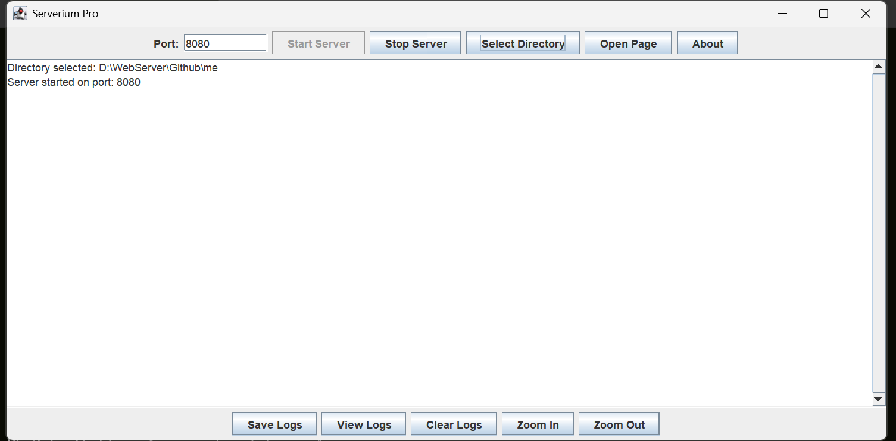
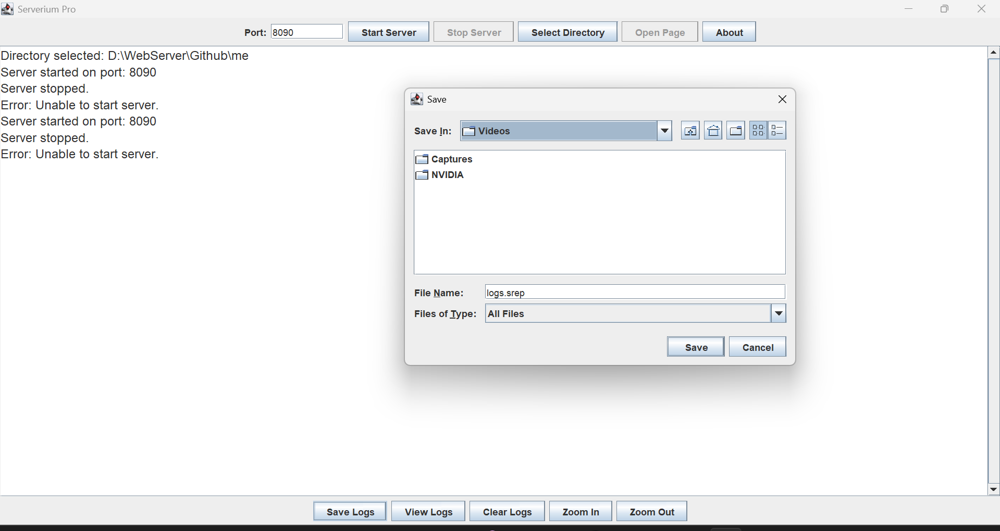
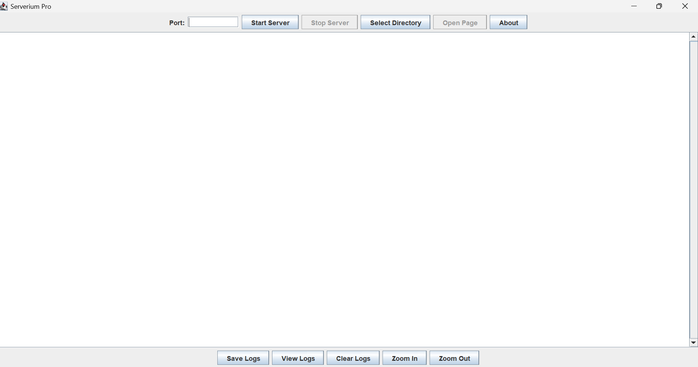

[](https://github.com/shravankumaruk/serverium-pro/releases)
[](https://github.com/shravankumaruk/serverium-pro/blob/main/LICENSE.md)
[](https://github.com/shravankumaruk/serverium-pro/stargazers)
[](https://github.com/shravankumaruk/serverium-pro/network/members)
[](https://github.com/shravankumaruk/serverium-pro/issues)
[](https://github.com/shravankumaruk/serverium-pro/commits/main)
[](https://github.com/shravankumaruk/serverium-pro)
[](https://github.com/shravankumaruk/serverium-pro/releases)
[](https://www.oracle.com/java/)
[]()
[]()
<p align="center">
  
</p>

# Serverium Pro (SimpleServerApp)

A lightweight Java Swing application that serves static files over HTTP, logs requests, and provides an intuitive GUI for managing your local server.Can be used for testing your web applications easily and manage all requests save and view them for debugging too!

---
[](https://github.com/shravankumaruk)
[](https://#) 
[](https://#)


[](https://#)


## 🚀 Table of Contents

1. [Prerequisites](#prerequisites)
2. [Installation](#installation)

   * [Windows 11](#windows-11)
   * [Ubuntu / Debian / Kali Linux](#ubuntu--debian--kali-linux)
3. [Usage](#usage)
4. [Screenshots](#screenshots)
5. [Contributing & Star the Project](#contributing--star-the-project)
6. [License](#license)

---

## 📋 Prerequisites

Before running **Serverium Pro**, ensure you have the following installed on your system:

* **Java Development Kit (JDK) 17 or later (tested on Oracle JDK 24)**
* **Git** (to clone the repository)

Verify Java installation:

```bash
java -version
javac -version
```

You should see output like `java version "17"` or higher (If its 24 then great).

---

## 🛠️ Installation

### Windows 11


**🖥️ *Update*:you can download the latest Windows ZIP (with ServeriumPro.exe ready-to-run) from the [Releases](https://github.com/shravankumaruk/serverium-pro/releases) section and simply unzip & launch.**


1. **Install JDK**

   * Download and install the latest JDK from [Oracle](https://www.oracle.com/java/technologies/javase-downloads.html) or [AdoptOpenJDK](https://adoptium.net/).
   * During setup, check **Add to PATH**.

2. **Clone the repository**

   ```powershell
   git clone https://github.com/shravankumaruk/serverium-pro.git
   cd serverium-pro
   ```

3. **Build the project**

   ```powershell
   javac SimpleServerApp.java
   ```

4. **Run the application**

   ```powershell
   java SimpleServerApp
   ```

---

### Ubuntu / Debian / Kali Linux

1. **Install JDK & Git**

   ```bash
   sudo apt update
   sudo apt install -y default-jdk
   ```

2. **Clone the repository**

   ```bash
   git clone https://github.com/shravankumaruk/serverium-pro.git
   cd serverium-pro
   ```

3. **Build the project**

   ```bash
   javac SimpleServerApp.java
   ```

4. **Run the application**

   ```bash
   java SimpleServerApp
   ```

---

## ▶️ Usage

1. **Launch** the GUI by running the application as shown above.
2. **Enter a port** (above 1024).
3. **Select a directory** to serve static files from.
4. click **Start Server**
5. Use **Open Page** to view the served content in your default browser.
6. **Save**, **View**, or **Clear** logs using the respective buttons.
7. **Zoom In/Out** in the log panel or use `Ctrl +` / `Ctrl -`.

---

## 📸 Screenshots

  
*Figure 1. Starting the server and initial log output.*

  
*Figure 2. Saving logs into a `.srep` file.*

  
*Figure 3. Main interface showing controls and log panel.*


---


## 🔧Maintenance & Support 

I am committed to promptly updating this project in the event that any vulnerabilities or issues are discovered. Please report any problems or security concerns at: https://github.com/shravankumaruk/serverium-pro/issues 


## ⭐ Contributing & Star the Project

Contributions are welcome! To help improve Serverium Pro:

1. Fork the repository
2. Create a feature branch (`git checkout -b feature/YourFeature`)
3. Commit your changes (`git commit -m "Add YourFeature"`)
4. Push to the branch (`git push origin feature/YourFeature`)
5. Open a Pull Request

If you find this tool useful, please ⭐ **star** the repo:

[GitHub • Serverium Pro](https://github.com/shravankumaruk/serverium-pro)

---

## 📝 License

This project is licensed under the [GNU GPL v3.0](LICENSE.md). Feel free to use and modify, provided you retain the **original credit** and license notice.
